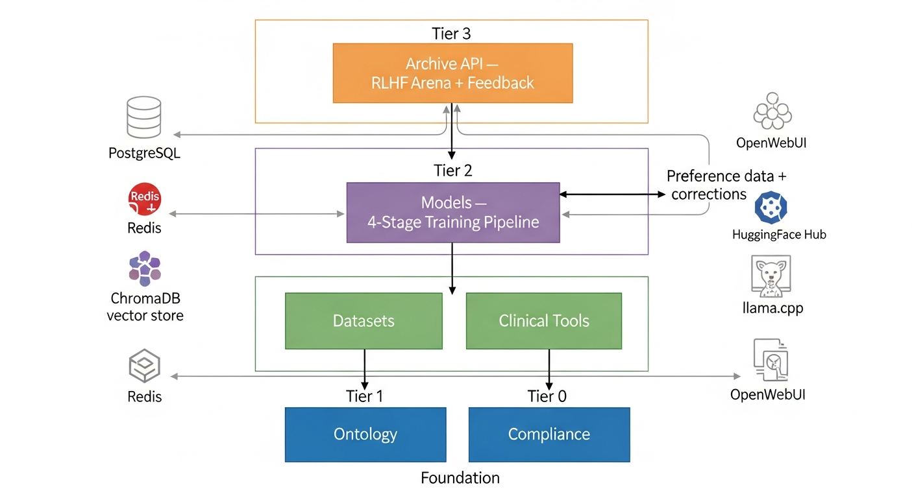
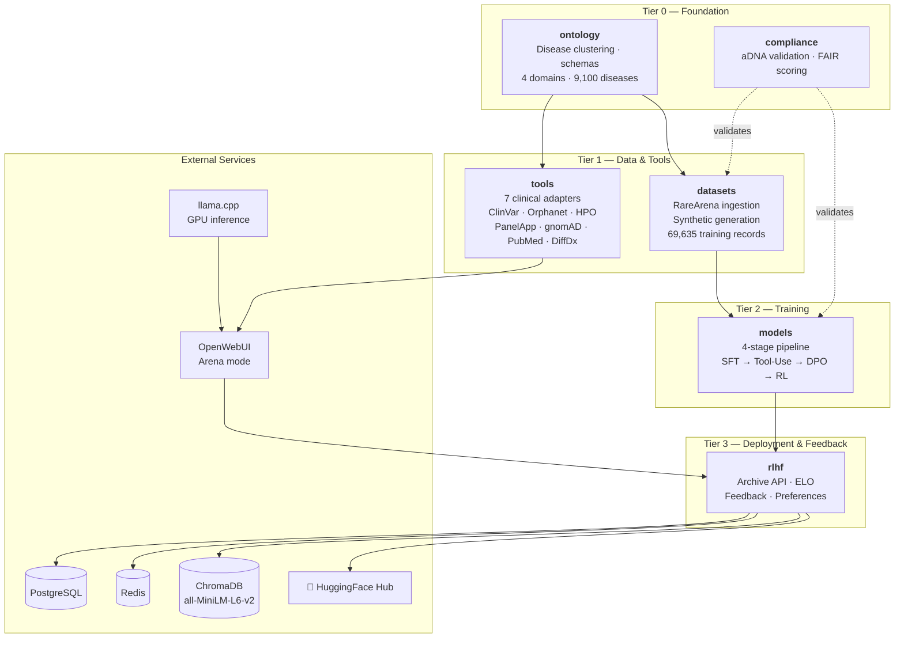
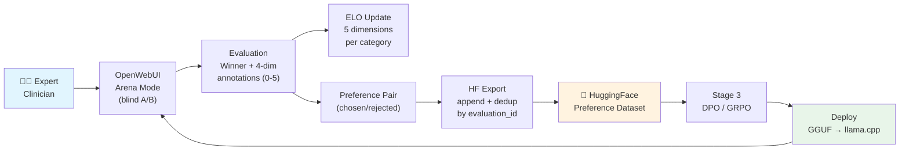
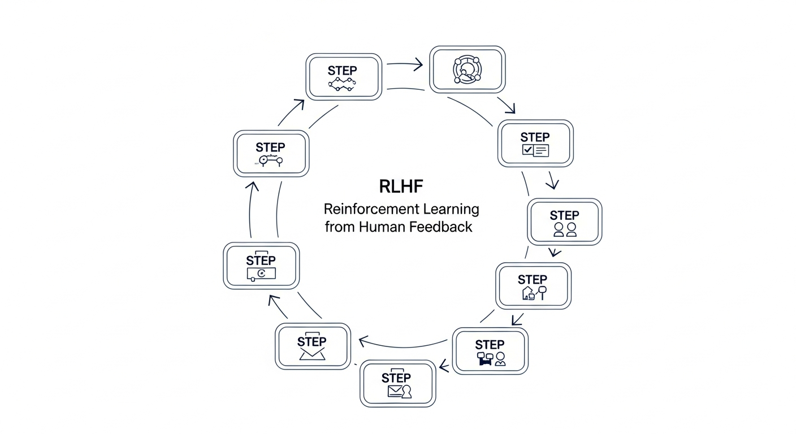
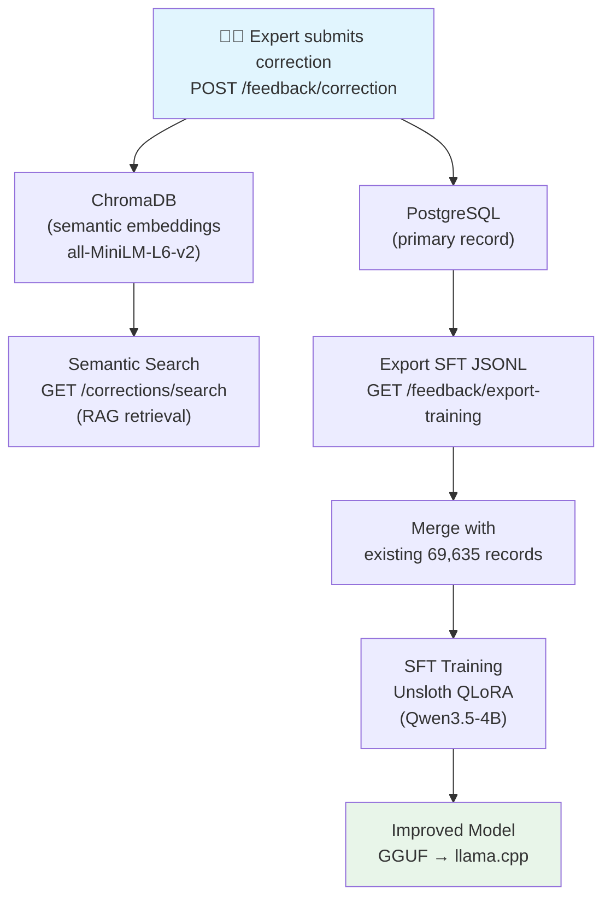
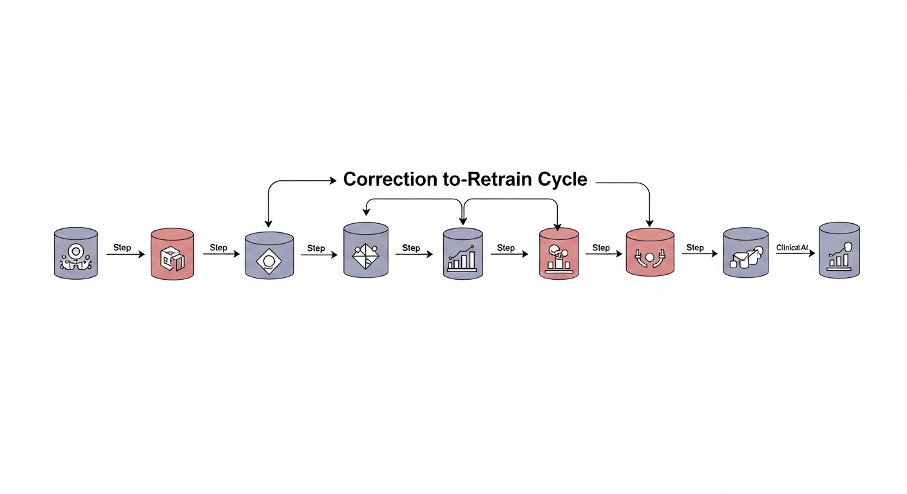
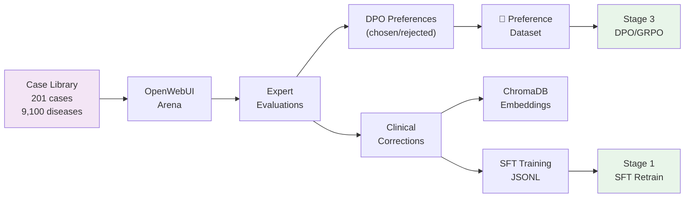

# Architecture

A technical overview of the Rare AI Archive system — its packages, data flows, and external integrations.

## System Overview

The Archive is a monorepo of 6 Python packages that form a pipeline from disease ontology through model training to clinical deployment with feedback.

## RLHF Feedback Loop

Clinical experts evaluate model responses in blind A/B comparisons through OpenWebUI's Arena mode. Evaluations drive multi-dimensional ELO ratings and produce DPO-compatible preference data for training.

**ELO Dimensions**: Overall, Diagnostic Accuracy, Reasoning Quality, Tool Usage, Safety — each tracked per model, per disease category, per evaluation mode. K-factor: 32, initial rating: 1500.

## Correction → Retrain Cycle

When an expert identifies a diagnostic error, the correction flows through dual storage (PostgreSQL + ChromaDB) into training data and back into an improved model.

**SFT Format**: Each correction exports as a chat-format JSONL record with `system` (diagnostician prompt), `user` (case vignette), and `assistant` (corrected diagnosis + reasoning). This matches the existing training data format for seamless merging.

## Data Flow

## Archive API

The RLHF backend (`packages/rlhf/src/archive_api/`) is a FastAPI application with 6 routers:

### Endpoints

| Router | Endpoint | Method | Description |
|--------|----------|--------|-------------|
| **elo** | `/elo/ratings` | GET | All model ratings (filterable by category) |
| | `/elo/ratings/{model_id}` | GET | Ratings for a model across categories |
| | `/elo/update` | POST | Update ELO after comparison |
| **experts** | `/experts/register` | POST | Register clinical expert |
| | `/experts/` | GET | List active experts |
| | `/experts/match/{category}` | GET | Match experts to disease category |
| **evaluations** | `/evaluations/submit` | POST | Submit Arena evaluation + trigger ELO |
| | `/evaluations/stats` | GET | Evaluation counts by category |
| **preferences** | `/preferences/pairs` | GET | Extract DPO preference pairs |
| | `/preferences/export` | POST | Export to HuggingFace (append + dedup) |
| **cases** | `/cases/create` | POST | Add a clinical case |
| | `/cases/batch` | POST | Batch insert (skip duplicates) |
| | `/cases/{case_id}` | GET | Retrieve case by ID |
| | `/cases/random/pick` | GET | Random case (optional category filter) |
| | `/cases/` | GET | List with pagination |
| **feedback** | `/feedback/correction` | POST | Submit correction → PostgreSQL + ChromaDB |
| | `/feedback/annotation` | POST | Submit free-text annotation |
| | `/feedback/corrections/search` | GET | Semantic search via ChromaDB |
| | `/feedback/corrections/{case_id}` | GET | Get corrections for a case |
| | `/feedback/export-training` | GET | Export corrections as SFT JSONL |
| | `/feedback/stats` | GET | Feedback counts by type + severity |
| **root** | `/health` | GET | Health check |

### Database Models

| Model | Key Fields | Purpose |
|-------|-----------|---------|
| **Expert** | username, subspecialty, patient_categories | Registered clinical evaluators |
| **ModelRating** | model_id, category, 5× ELO dimensions | Multi-dimensional ELO per model per category |
| **Evaluation** | expert_id, case_id, winner, annotations | Arena comparison records |
| **Case** | case_id, category, vignette, known_diagnosis | Clinical case library |
| **ClinicalFeedback** | case_id, feedback_type, corrected_diagnosis | Corrections, annotations, suggestions |
| **PreferenceExport** | export_date, evaluation_count, hf_commit | HuggingFace export tracking |

## Infrastructure

Deployed on L2 (4× A100-80GB) via Docker Compose:

| Container | Port | Purpose |
|-----------|------|---------|
| `rare-archive-llama-primary` | 8082 | Qwen3.5-35B-A3B inference (GPU 3) |
| `rare-archive-llama-arena` | 8083 | 4B SFT challenger (GPU 3) |
| `rare-archive-openwebui` | 3100 | Clinical interface + Arena mode |
| `rare-archive-chromadb` | 8084 | Vector storage (v0.5.23) |
| `rare-archive-api` | 8085 | Archive API (FastAPI) |
| `lattice-postgres` | 5432 | Shared PostgreSQL |
| `lattice-redis` | 6379 | Shared Redis |
| `lattice-prometheus` | 9090 | Metrics collection |
| `lattice-grafana` | 3000 | Dashboards (via NGINX at `/grafana/`) |

All containers on the `lattice-l2` Docker network. NGINX reverse proxy at port 8000.

## Configuration

Environment variables for the Archive API (`config.py`):

| Variable | Default | Purpose |
|----------|---------|---------|
| `DATABASE_URL` | `postgresql+asyncpg://...localhost:5432/rare_archive` | PostgreSQL connection |
| `REDIS_URL` | `redis://localhost:6379/2` | Redis cache |
| `CHROMADB_URL` | `http://rare-archive-chromadb:8000` | ChromaDB server |
| `HF_TOKEN` | — | HuggingFace API token |
| `HF_ORG` | `wilhelm-foundation` | HuggingFace organization |
| `HF_DATASET` | `rare-archive-rlhf-preferences` | Preference dataset name |
| `ELO_K_FACTOR` | `32` | ELO K-factor |
| `ELO_INITIAL_RATING` | `1500` | Starting ELO for new models |
