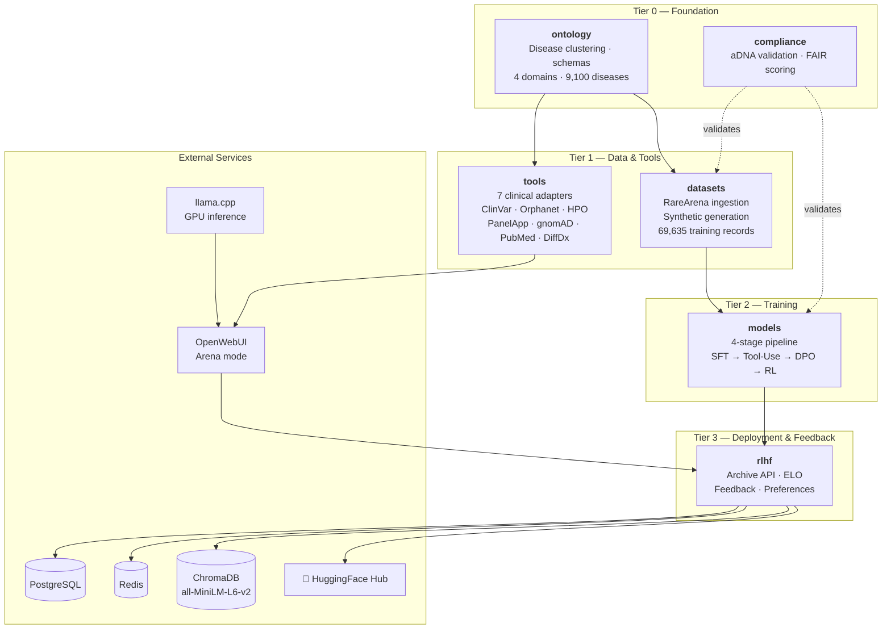
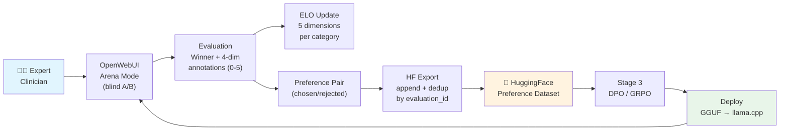
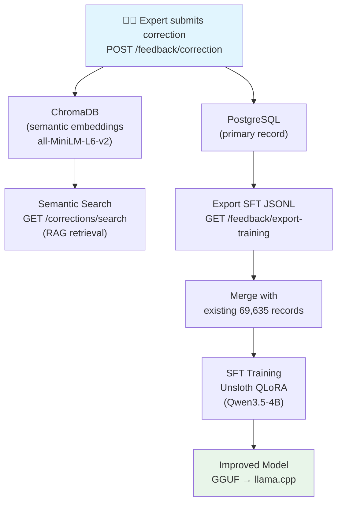
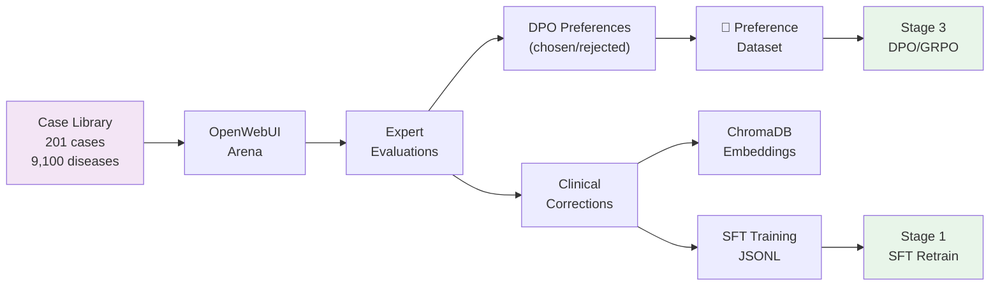

# Architecture

The Rare AI Archive is not a model — it is an **agentic diagnostic system** that reasons about clinical presentations, invokes real clinical tools to gather evidence, synthesizes findings into a differential diagnosis, and improves through clinician feedback. This document describes the system's architecture, data flows, and deployment infrastructure.


## Agentic Diagnostic System

Traditional clinical AI produces a prediction from an input. The Rare AI Archive produces a **diagnostic reasoning trace** — a multi-turn process where the model decides which tools to invoke, interprets their results, and synthesizes a differential diagnosis:

```
Reason  →  Identify symptom constellation, form initial hypothesis
Lookup  →  Query clinical databases (ClinVar, Orphanet, HPO, PanelApp, gnomAD)
Match   →  Cross-reference findings against phenotype-gene mappings
Search  →  Broaden when initial hypotheses don't explain all findings (PubMed, DiffDx)
Diagnose → Synthesize evidence into ranked differential with confidence and next steps
```

This trace pattern is what makes the system agentic: the model doesn't just answer — it *works through the case* the way a rare disease specialist does. Stage 2 of the training pipeline teaches the model this workflow by training on gold-standard traces where expert clinicians navigate real diagnostic cases with real tool API responses.

**Context drives tool selection.** The model's understanding of the patient's clinical presentation determines which tools to query, in what order, and how to interpret their outputs. A variant-centric case calls for ClinVar first; a phenotype-driven presentation starts with HPO. This context-driven reasoning is what distinguishes an agentic diagnostic system from a simple classifier — and it's the same reasoning that specialists bring to the [Undiagnosed Patient Hackathon](https://www.nature.com/articles/d41586-026-00302-8) series. The system is designed to integrate structured tool usage context — interpretation guides, workflow patterns, data-source-specific knowledge (e.g., how to read Oxford Nanopore structural variant calls) — alongside the tools themselves, so that models learn not just *what* tools exist but *when and why* to use them for specific clinical scenarios.

---

## System Overview

The Archive is a monorepo of 6 Python packages that form a pipeline from disease ontology through model training to clinical deployment with feedback.



## RLHF Feedback Loop

Clinical experts evaluate model responses in blind A/B comparisons through OpenWebUI's Arena mode. Evaluations drive multi-dimensional ELO ratings and produce DPO-compatible preference data for training.




**ELO Dimensions**: Overall, Diagnostic Accuracy, Reasoning Quality, Tool Usage, Safety — each tracked per model, per disease category, per evaluation mode. K-factor: 32, initial rating: 1500.

## Correction → Retrain Cycle

When an expert identifies a diagnostic error, the correction flows through dual storage (PostgreSQL + ChromaDB) into training data and back into an improved model.




**SFT Format**: Each correction exports as a chat-format JSONL record with `system` (diagnostician prompt), `user` (case vignette), and `assistant` (corrected diagnosis + reasoning). This matches the existing training data format for seamless merging.

## Condition-Specific Model Architecture

The Archive trains both foundation models (broad rare disease coverage) and condition-specific adapters (deep expertise in disease clusters). Both share the same base architecture — the adapters add a LoRA layer trained on domain-specific cases.

| Disease Cluster | Key Diseases | Training Cases | Adapter Status |
|----------------|-------------|----------------|----------------|
| **IEM / Lysosomal Storage** | Gaucher, Fabry, Pompe | ~2,400 | **Complete** |
| **Neuromuscular** | Duchenne, SMA, Myasthenia Gravis | ~300 | **Complete** |
| **Connective Tissue** | Ehlers-Danlos, Marfan | ~1,800 | Planned |
| **Autoimmune** | Sjogren's, Lupus | ~1,500 | Planned |
| **Mitochondrial** | MELAS, Leigh Syndrome | ~1,000 | Planned |

The **ontology** package drives cluster assignment: each disease maps to a category via Orphanet classifications, and categories determine which adapter to apply at inference time. This is also how the Arena tracks per-category ELO ratings — ensuring that model quality is measured where it matters, not just in aggregate.

## Data Flow

The training data comes from two sources: structured vignettes generated from medical literature (69,635 synthetic cases) and expert diagnostic traces captured during [Undiagnosed Patient Hackathons](https://www.nature.com/articles/d41586-026-00302-8) and clinical validation sessions. Both feed the 4-stage pipeline; corrections from the Arena close the loop.



## Archive API

The RLHF backend (`packages/rlhf/src/archive_api/`) is a FastAPI application with 6 routers:

### Endpoints

| Router | Endpoint | Method | Description |
|--------|----------|--------|-------------|
| **elo** | `/elo/ratings` | GET | All model ratings (filterable by category) |
| | `/elo/ratings/{model_id}` | GET | Ratings for a model across categories |
| | `/elo/update` | POST | Update ELO after comparison |
| **experts** | `/experts/register` | POST | Register clinical expert |
| | `/experts/` | GET | List active experts |
| | `/experts/match/{category}` | GET | Match experts to disease category |
| **evaluations** | `/evaluations/submit` | POST | Submit Arena evaluation + trigger ELO |
| | `/evaluations/stats` | GET | Evaluation counts by category |
| **preferences** | `/preferences/pairs` | GET | Extract DPO preference pairs |
| | `/preferences/export` | POST | Export to HuggingFace (append + dedup) |
| **cases** | `/cases/create` | POST | Add a clinical case |
| | `/cases/batch` | POST | Batch insert (skip duplicates) |
| | `/cases/{case_id}` | GET | Retrieve case by ID |
| | `/cases/random/pick` | GET | Random case (optional category filter) |
| | `/cases/` | GET | List with pagination |
| **feedback** | `/feedback/correction` | POST | Submit correction → PostgreSQL + ChromaDB |
| | `/feedback/annotation` | POST | Submit free-text annotation |
| | `/feedback/corrections/search` | GET | Semantic search via ChromaDB |
| | `/feedback/corrections/{case_id}` | GET | Get corrections for a case |
| | `/feedback/export-training` | GET | Export corrections as SFT JSONL |
| | `/feedback/stats` | GET | Feedback counts by type + severity |
| **root** | `/health` | GET | Health check |

### Database Models

| Model | Key Fields | Purpose |
|-------|-----------|---------|
| **Expert** | username, subspecialty, patient_categories | Registered clinical evaluators |
| **ModelRating** | model_id, category, 5× ELO dimensions | Multi-dimensional ELO per model per category |
| **Evaluation** | expert_id, case_id, winner, annotations | Arena comparison records |
| **Case** | case_id, category, vignette, known_diagnosis | Clinical case library |
| **ClinicalFeedback** | case_id, feedback_type, corrected_diagnosis | Corrections, annotations, suggestions |
| **PreferenceExport** | export_date, evaluation_count, hf_commit | HuggingFace export tracking |

## Infrastructure

Deployed on L2 (4× A100-80GB) via Docker Compose:

| Container | Port | Purpose |
|-----------|------|---------|
| `rare-archive-llama-primary` | 8082 | Qwen3.5-35B-A3B inference (GPU 3) |
| `rare-archive-llama-arena` | 8083 | 4B SFT challenger (GPU 3) |
| `rare-archive-openwebui` | 3100 | Clinical interface + Arena mode |
| `rare-archive-chromadb` | 8084 | Vector storage (v0.5.23) |
| `rare-archive-api` | 8085 | Archive API (FastAPI) |
| `lattice-postgres` | 5432 | Shared PostgreSQL |
| `lattice-redis` | 6379 | Shared Redis |
| `lattice-prometheus` | 9090 | Metrics collection |
| `lattice-grafana` | 3000 | Dashboards (via NGINX at `/grafana/`) |

All containers on the `lattice-l2` Docker network. NGINX reverse proxy at port 8000.

## Deployment Tiers

The Archive is designed to run at three scales. The same model weights and tool adapters work at every tier — what changes is the infrastructure around them.

| Tier | Environment | Hardware | What Runs | Use Case |
|------|------------|----------|-----------|----------|
| **L1 (Edge)** | Laptop or clinic workstation | Apple Silicon / consumer GPU | llama.cpp + GGUF model, OpenWebUI, clinical tools | Single-clinician diagnostic support. Rural clinics, research fellows, offline use. |
| **L2 (HPC)** | On-premises server | 4× A100-80GB, Docker Compose | Full stack: multi-model inference, Arena mode, Archive API, ChromaDB, Grafana | Research hospitals, training runs, clinician evaluation campaigns, multi-model comparison. |
| **L3 (Cloud)** | Elastic compute (planned) | GPU instances on demand | Federated training, multi-site Arena, burst inference | Multi-institution collaborations, federated model training without data movement. |

L1 nodes can operate independently or connect to an L2 hub for model updates and federated feedback. L3 extends this to cross-institutional collaboration where training data never leaves the originating site.

## Configuration

Environment variables for the Archive API (`config.py`):

| Variable | Default | Purpose |
|----------|---------|---------|
| `DATABASE_URL` | `postgresql+asyncpg://...localhost:5432/rare_archive` | PostgreSQL connection |
| `REDIS_URL` | `redis://localhost:6379/2` | Redis cache |
| `CHROMADB_URL` | `http://rare-archive-chromadb:8000` | ChromaDB server |
| `HF_TOKEN` | — | HuggingFace API token |
| `HF_ORG` | `wilhelm-foundation` | HuggingFace organization |
| `HF_DATASET` | `rare-archive-rlhf-preferences` | Preference dataset name |
| `ELO_K_FACTOR` | `32` | ELO K-factor |
| `ELO_INITIAL_RATING` | `1500` | Starting ELO for new models |

---

## References

This architecture builds on foundational work in computational phenotyping and rare disease informatics:

- Groza T, Baynam G, Jamuar SS. Reimagining care of people living with rare diseases with AI. *PLOS Medicine*. 2026. [DOI: 10.1371/journal.pmed.1004966](https://doi.org/10.1371/journal.pmed.1004966)
- Groza T et al. Information content as a health system screening tool for rare diseases. *npj Digital Medicine*. 2025;8:720. [DOI: 10.1038/s41746-025-02096-x](https://doi.org/10.1038/s41746-025-02096-x)
- Reese JT et al. Systematic benchmarking demonstrates LLMs have not reached diagnostic accuracy of traditional tools. *EJHG*. 2026. [DOI: 10.1038/s41431-026-02054-5](https://doi.org/10.1038/s41431-026-02054-5)
- Jacobsen JOB et al. The GA4GH Phenopacket schema defines a computable representation of clinical data. *Nature Biotechnology*. 2022;40:817-820. [DOI: 10.1038/s41587-022-01357-4](https://doi.org/10.1038/s41587-022-01357-4)
- Köhler S et al. The Human Phenotype Ontology: Semantic Unification of Common and Rare Disease. *AJHG*. 2015;97(1):111-124. [DOI: 10.1016/j.ajhg.2015.05.020](https://doi.org/10.1016/j.ajhg.2015.05.020)
