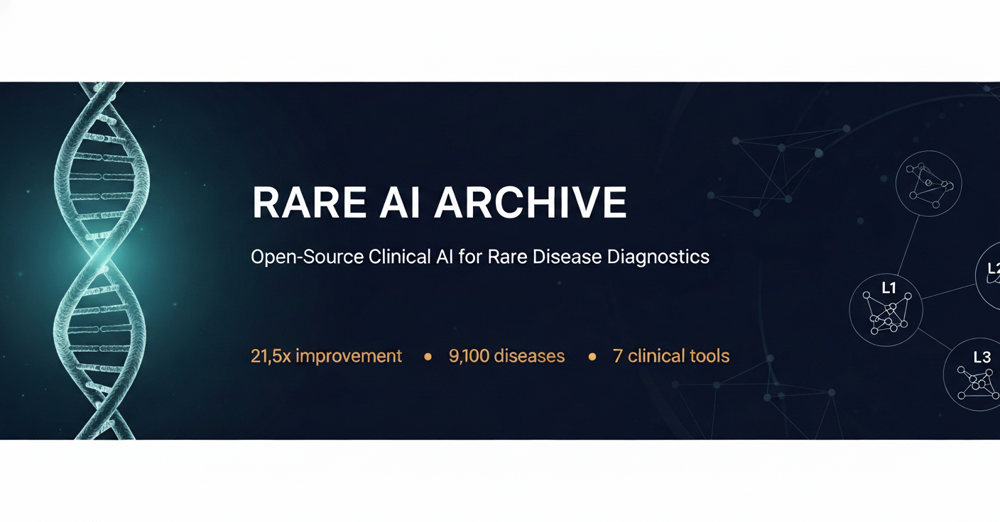
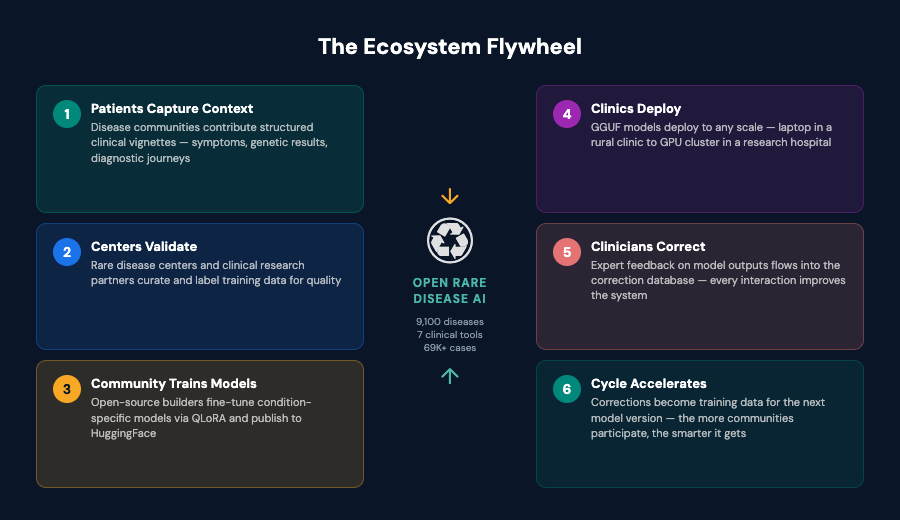

<p align="center">
  <a href="https://github.com/Wilhelm-Foundation/rare-archive">
    
  </a>
</p>

<p align="center">
  <a href="https://github.com/Wilhelm-Foundation/rare-archive/actions/workflows/ci.yaml"></a>
  <a href="LICENSE"></a>
  <a href="https://huggingface.co/Wilhelm-Foundation"></a>
  <a href="https://huggingface.co/spaces/Wilhelm-Foundation/rare-archive-clinical-demo"></a>
  <a href="https://github.com/Wilhelm-Foundation/rare-archive/discussions"></a>
</p>

---

300 million people worldwide live with a rare disease. The average diagnostic odyssey takes **5-7 years** — years of misdiagnoses, unnecessary procedures, and uncertainty. 95% of rare diseases have no approved treatment.

**The Rare AI Archive exists to close that gap.**

We are building an open ecosystem for rare disease AI — where patient communities create clinical context, rare disease centers validate it, and open-source model builders turn it into deployed diagnostic tools that improve with every clinician interaction.

*A program of the [Wilhelm Foundation](https://wilhelm.foundation) &middot; Powered by [Lattice Protocol](https://github.com/LatticeProtocol) (open infrastructure for composable, federated AI workflows)*

> **Research Use Only.** The Rare AI Archive is a clinical decision support system, not a diagnostic tool. It is **not FDA/CE-cleared** for medical use. All outputs require expert clinical validation.

<table>
<tr>
<td align="center"><strong>21.5x</strong><br><sub>Diagnostic improvement<br>(Stage 1 of 4)</sub></td>
<td align="center"><strong>69,635</strong><br><sub>Training cases across<br>9,100 rare diseases</sub></td>
<td align="center"><strong>7</strong><br><sub>Live clinical tools<br>(ClinVar, Orphanet, HPO...)</sub></td>
<td align="center"><strong>5</strong><br><sub>Disease-specific models<br>(2 complete, 3 planned)</sub></td>
</tr>
</table>

---

## The Ecosystem

The Rare AI Archive is not a single model. It is a **decentralized, collaborative post-training ecosystem** where the people closest to rare diseases contribute the context that makes AI useful.



**Three roles drive the ecosystem:**

| Role | Who | What they do |
|------|-----|-------------|
| **Context Creators** | Patients, families, clinicians | Capture structured clinical vignettes — symptom timelines, genetic results, diagnostic journeys |
| **Validators** | Rare disease centers, research partners | Validate and curate training data, ensuring clinical accuracy and safety |
| **Model Builders** | Open-source ML engineers | Fine-tune condition-specific models and publish them on HuggingFace |

Each role feeds the next. The more communities participate, the smarter the system becomes.

### Why Open Source Matters

| | |
|---|---|
| **Open** | Every line of code, every training record, every model weight is inspectable. Rare disease patients deserve visibility, not proprietary lockdown. |
| **Federated** | Your data never leaves your institution. Models can be fine-tuned locally with your own cases. |
| **Composable** | Built on [aDNA modules](https://github.com/LatticeProtocol) that can be independently improved, replaced, or combined. Swap the base model, add new tools, extend datasets. |
| **Deployed** | Running on production hardware with 7 live clinical tools — not just a paper. |

---

## Architecture


The Archive is built on the [Lattice Protocol](https://github.com/LatticeProtocol) standard and organized as an 8-package monorepo:

| Package | Purpose |
|---------|---------|
| **[ontology](packages/ontology)** | Disease clustering (9,100 diseases), clinical tool registry, schemas |
| **[models](packages/models)** | 4-stage training pipeline: SFT &rarr; Tool-Use &rarr; DPO/GRPO &rarr; RL |
| **[datasets](packages/datasets)** | RareArena ingestion, synthetic patient generation, preference data |
| **[rlhf](packages/rlhf)** | Clinician evaluation portal: ELO ranking, correction-to-retrain loop |
| **[tools](packages/tools)** | 7 clinical tool adapters (ClinVar, Orphanet, PanelApp, gnomAD, HPO, PubMed, DiffDx) |
| **[compliance](packages/compliance)** | FAIR scoring, aDNA schema validation, governance |
| **[deploy](deploy)** | Docker Compose overlays for L1 (edge) and L2 (HPC) deployment |
| **[docs](docs#readme)** | [11 guides](docs#readme) covering setup, evaluation, quantization, and more |

> For full architecture diagrams and data flow details, see **[ARCHITECTURE.md](ARCHITECTURE.md)**.

---

## Quick Start

**Try the demo** (no install needed): Visit the **[Clinical Demo Space](https://huggingface.co/spaces/Wilhelm-Foundation/rare-archive-clinical-demo)** — 10 pre-built clinical scenarios.

**Run locally** with llama.cpp:

```bash
# Download the 4B model (~4.2 GB) and serve locally
pip install huggingface_hub
huggingface-cli download Wilhelm-Foundation/rare-archive-qwen-4b-sft-v1 \
  rare-archive-qwen-4b-sft-v1-Q8_0.gguf --local-dir ~/Models

# Start inference (Metal for Mac, CUDA for Linux)
llama-server -m ~/Models/rare-archive-qwen-4b-sft-v1-Q8_0.gguf -ngl 99 --port 8082
```

> See the full **[L1 Local Setup Guide](docs/l1_local_setup.md)** for Apple Silicon instructions and OpenWebUI integration.

<details>
<summary><strong>Example: Clinical Diagnostic Reasoning</strong></summary>

**Query:** *"8-year-old with progressive proximal muscle weakness, elevated CK, Gower sign positive"*

```
Differential Diagnosis:
1. Duchenne Muscular Dystrophy (DMD) — most likely given age, sex-linked
   inheritance pattern, proximal weakness, and markedly elevated CK
2. Becker Muscular Dystrophy (BMD) — milder variant, later onset possible
3. Limb-Girdle Muscular Dystrophy (LGMD) — autosomal forms to consider

Recommended workups:
- Dystrophin gene (DMD) sequencing via ClinVar [tool: clinvar_lookup]
- HPO phenotype matching for HP:0003236 (elevated CK) [tool: hpo_lookup]
- PanelApp neuromuscular panel review [tool: panelapp_search]
```

</details>

**Development setup:**

```bash
git clone https://github.com/Wilhelm-Foundation/rare-archive.git && cd rare-archive
./scripts/setup_dev.sh          # Install all packages in dev mode
python scripts/validate_archive.py .   # Validate the archive
```

---

## Training Pipeline

We fine-tune [Qwen 3.5](https://huggingface.co/Qwen) models across 4 progressive stages using [Unsloth](https://github.com/unslothai/unsloth) (QLoRA):

| Stage | What it does | Status |
|-------|-------------|--------|
| **1. SFT** | Supervised fine-tuning on 69K+ RareArena + synthetic cases for clinical reasoning | **Complete** |
| **2. Tool-Use** | Agentic SFT teaching the model to invoke ClinVar, Orphanet, PanelApp, HPO | In progress |
| **3. DPO/GRPO** | Preference alignment from clinician evaluations on L2 | Planned |
| **4. Progressive RL** | Reward optimization for Top-1 diagnostic accuracy | Planned |

---

## Models

### Foundation Models

| Model | Params | Size | Deployment Tier | Status |
|-------|--------|------|----------------|--------|
| [**Qwen3.5-4B SFT**](https://huggingface.co/Wilhelm-Foundation/rare-archive-qwen-4b-sft-v1) | 4B dense | ~3 GB | L1 (laptop/edge) | **Published** |
| Qwen3.5-35B-A3B | 35B MoE (3B active) | ~37 GB | L2 (HPC) | Training |

### Condition-Specific Models

Specialized models for disease clusters — each trained on domain-specific data:

| Disease Cluster | Key Diseases | Training Cases | Status |
|----------------|-------------|----------------|--------|
| **IEM / Lysosomal Storage** | Gaucher, Fabry, Pompe | ~2,400 | **Adapter complete** |
| **Neuromuscular** | Duchenne, SMA, Myasthenia Gravis | ~300 | **Adapter complete** |
| **Connective Tissue** | Ehlers-Danlos, Marfan | ~1,800 | Planned |
| **Autoimmune** | Sjogren's, Lupus | ~1,500 | Planned |
| **Mitochondrial** | MELAS, Leigh Syndrome | ~1,000 | Planned |

> All published models are available at [huggingface.co/Wilhelm-Foundation](https://huggingface.co/Wilhelm-Foundation) in GGUF format.

---

## Roadmap

| Milestone | Status |
|-----------|--------|
| Stage 1 SFT — 21.5% Top-1 (21.5x over baseline) | **Complete** |
| Condition-specific models — IEM + Neuromuscular adapters | **Complete** |
| Stage 2 Tool-Use — gold-standard clinical tool traces | In progress |
| Community onboarding — templates for disease communities | Planned |
| Rare disease diagnosis leaderboard — open benchmarking | Planned |
| Federated multi-site deployment — data sovereignty | Planned |
| Stage 3 DPO/GRPO — clinician preference alignment | Planned |
| Stage 4 Progressive RL — reward-optimized reasoning | Planned |
| Regulatory pathway exploration — FDA/CE AI-as-SaMD guidance | Future |

---

## Community

Whether you're a **clinician**, **ML engineer**, **bioinformatician**, or **patient advocate** — there's a role for you in the ecosystem ([see roles above](#the-ecosystem)).

- **[Contributing Guide](CONTRIBUTING.md)** — how to start
- **[GitHub Discussions](https://github.com/Wilhelm-Foundation/rare-archive/discussions)** — questions, ideas, feedback
- **[Clinical Demo](https://huggingface.co/spaces/Wilhelm-Foundation/rare-archive-clinical-demo)** — try it before you build on it
- **[HuggingFace Collection](https://huggingface.co/collections/Wilhelm-Foundation/rare-ai-archive-complete-toolkit-69c4b1e14800a370fe028851)** — model + 3 datasets + demo

## Cite Us

```bibtex
@software{rare_ai_archive_2026,
  title     = {Rare AI Archive: Open-Source Clinical AI for Rare Disease Diagnostics},
  author    = {Wilhelm Foundation and Lattice Protocol},
  year      = {2026},
  url       = {https://github.com/Wilhelm-Foundation/rare-archive},
  license   = {Apache-2.0},
  note      = {A decentralized post-training ecosystem for rare genetic diseases}
}
```

## Related Work

The rare disease AI space is advancing rapidly. We build on and acknowledge outstanding work:

- **[DeepRare](https://doi.org/10.1038/s41591-025-03547-w)** (2025) — 57.18% Recall@1 with 40+ tools (closed-source)
- **[RareSeek R1](https://arxiv.org/abs/2503.07632)** (2025) — physician-parity on EHR narratives
- **[Zebra-Llama](https://arxiv.org/abs/2410.12045)** (2024) — single-disease specialization for EDS

Our approach is complementary — building the open ecosystem where many models, communities, and deployment sites collaborate to make rare disease AI continuously better. We welcome comparison and collaboration.

## License

Apache 2.0 — see [LICENSE](LICENSE) for details.

---

<p align="center"><strong>No disease is too rare to matter.</strong></p>
<p align="center">
  <a href="https://huggingface.co/spaces/Wilhelm-Foundation/rare-archive-clinical-demo">Try the Demo</a> &middot;
  <a href="https://github.com/Wilhelm-Foundation/rare-archive/discussions">Join the Discussion</a> &middot;
  <a href="CONTRIBUTING.md">Contribute</a> &middot;
  <a href="https://wilhelm.foundation">Wilhelm Foundation</a>
</p>
