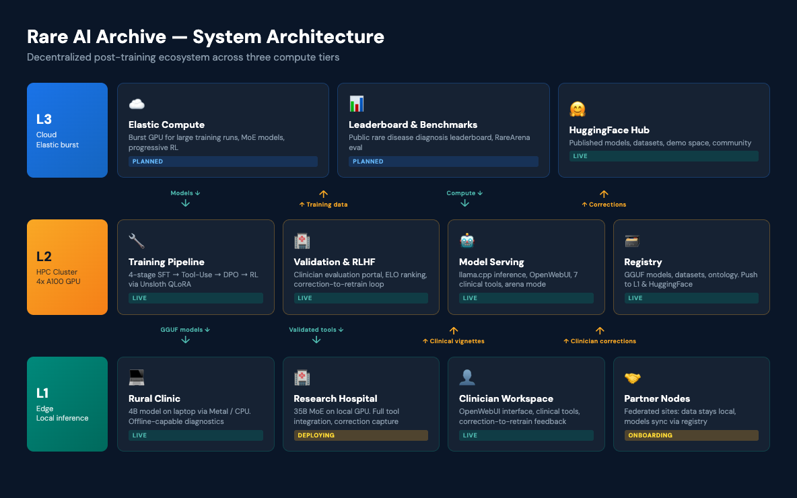
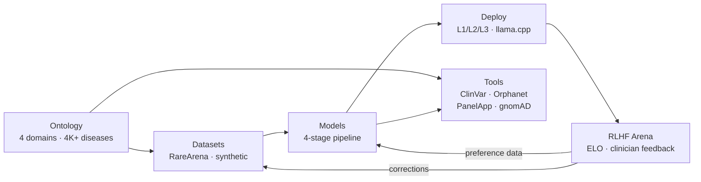

<p align="center">
  <a href="https://github.com/Wilhelm-Foundation/rare-archive">
    
  </a>
</p>

<p align="center">
  <a href="https://github.com/Wilhelm-Foundation/rare-archive/actions/workflows/ci.yaml"></a>
  <a href="LICENSE"></a>
  <a href="https://huggingface.co/Wilhelm-Foundation"></a>
  <a href="https://huggingface.co/spaces/Wilhelm-Foundation/rare-archive-clinical-demo"></a>
  <a href="https://python.org"></a>
</p>

---

300 million people worldwide live with a rare disease. The average diagnostic odyssey takes 5-7 years. During that time, families navigate a maze of specialists, tests, and uncertainty — often without ever receiving a diagnosis.

**The Rare AI Archive exists to close that gap.**

We build open-source AI models specialized in rare disease diagnostics, validated by the clinicians who treat these patients, and deployable at every scale — from a laptop in a rural clinic to a GPU cluster in a research hospital.

*A program of the [Wilhelm Foundation](https://wilhelm.foundation)*

### Key Results

- **21.5x improvement** in diagnostic accuracy (Stage 1 SFT — and we're just getting started)
- **69,635 training records** across 9,100 rare diseases
- **7 live clinical tools**: ClinVar, Orphanet, HPO, PanelApp, gnomAD, PubMed, DiffDx
- **Correction-to-retrain cycle** operational end-to-end — clinician feedback improves the system with every interaction

---

## System Architecture

<p align="center">
  
</p>

> For full architecture diagrams, dependency graphs, and data flow details, see **[ARCHITECTURE.md](ARCHITECTURE.md)**.

## How It Works



## Quick Start

### Option 1: Try the demo (no install needed)

Visit the **[Clinical Demo Space](https://huggingface.co/spaces/Wilhelm-Foundation/rare-archive-clinical-demo)** — 10 pre-built scenarios covering Gaucher, Duchenne, Fabry, and more.

### Option 2: Run locally with llama.cpp

```bash
# 1. Download the model (~4.2 GB)
pip install huggingface_hub
huggingface-cli download Wilhelm-Foundation/rare-archive-qwen-4b-sft-v1 \
  rare-archive-qwen-4b-sft-v1-Q8_0.gguf \
  --local-dir ~/Models

# 2. Start the inference server (requires llama.cpp — see docs/l1_local_setup.md)
llama-server -m ~/Models/rare-archive-qwen-4b-sft-v1-Q8_0.gguf -ngl 99 --port 8082

# 3. Ask a clinical question
curl http://localhost:8082/v1/chat/completions \
  -H "Content-Type: application/json" \
  -d '{
    "model": "rare-archive",
    "messages": [{"role": "user", "content": "5-year-old with hepatosplenomegaly, bone pain, and Erlenmeyer flask deformity on X-ray. What rare diseases should I consider?"}],
    "max_tokens": 512
  }'
```

> See the full **[L1 Local Setup Guide](docs/l1_local_setup.md)** for Apple Silicon build instructions and OpenWebUI integration.

### Option 3: Development setup

```bash
# Clone and install all packages in development mode
git clone https://github.com/Wilhelm-Foundation/rare-archive.git
cd rare-archive
./scripts/setup_dev.sh

# Validate the archive
python scripts/validate_archive.py .
```

<details>
<summary><strong>Example Output</strong></summary>

Query: *"8-year-old with progressive proximal muscle weakness, elevated CK, Gower sign positive"*

```
Differential Diagnosis:
1. Duchenne Muscular Dystrophy (DMD) — most likely given age, sex-linked
   inheritance pattern, proximal weakness, and markedly elevated CK
2. Becker Muscular Dystrophy (BMD) — milder variant, later onset possible
3. Limb-Girdle Muscular Dystrophy (LGMD) — autosomal forms to consider

Recommended workups:
- Dystrophin gene (DMD) sequencing via ClinVar [tool: clinvar_lookup]
- HPO phenotype matching for HP:0003236 (elevated CK) [tool: hpo_lookup]
- PanelApp neuromuscular panel review [tool: panelapp_search]
```

</details>

## Architecture

The Archive is built on the [Lattice Protocol](https://github.com/LatticeProtocol) standard and organized as a monorepo:

| Package | Purpose |
|---------|---------|
| **[packages/ontology](packages/ontology)** | Disease clustering, clinical tool registry, model/dataset schemas |
| **[packages/models](packages/models)** | 4-stage training pipeline: SFT → Tool-Use → DPO/GRPO → RL |
| **[packages/datasets](packages/datasets)** | RareArena ingestion, synthetic patients, preference data |
| **[packages/rlhf](packages/rlhf)** | Clinician evaluation portal: multi-dimensional ELO, feedback loops, ChromaDB embeddings |
| **[packages/tools](packages/tools)** | Clinical tool integrations (ClinVar, Orphanet, PanelApp, gnomAD, HPO, PubMed) |
| **[packages/compliance](packages/compliance)** | FAIR scoring, aDNA schema validation, governance |
| **[deploy](deploy)** | Docker Compose overlays for L1/L2 deployment |
| **[docs](docs#readme)** | [11 guides](docs#readme): quantization, evaluation, troubleshooting, tool integration, L1 setup, and more |

## Training Pipeline

We fine-tune [Qwen 3.5](https://huggingface.co/Qwen) models across 4 progressive stages:

| Stage | Method | Data Source | Goal |
|-------|--------|-------------|------|
| 1. SFT | Supervised fine-tuning | RareArena + synthetic cases | Clinical diagnostic reasoning |
| 2. Tool-Use SFT | Agentic traces | Gold-standard tool invocations | ClinVar/Orphanet/PanelApp usage |
| 3. DPO/GRPO | Preference alignment | Clinician evaluations from L2 | Expert-aligned reasoning |
| 4. Progressive RL | Reward optimization | RareArena-derived reward | Top-1 diagnostic accuracy |

**Frameworks:** [Unsloth](https://github.com/unslothai/unsloth) for all model sizes (QLoRA). Dense models use 4-bit quantization; MoE models use bf16 with `lora_dropout=0.0`.

## Models

| Priority | Model | Params | GGUF Size | Deployment | Status |
|----------|-------|--------|-----------|------------|--------|
| 1 | [Qwen3.5-4B](https://huggingface.co/Wilhelm-Foundation/rare-archive-qwen-4b-sft-v1) | 4B dense | ~3 GB | L1 standard | **Published** |
| 2 | Qwen3.5-9B | 9B dense | ~6.5 GB | L1 primary | Planned |
| 3 | Qwen3.5-27B | 27B dense | ~16 GB | L2 standard | Planned |
| 4 | Qwen3.5-35B-A3B | 35B MoE (3B active) | ~37 GB | L2 efficient | Training |

> **Download models:** All published models are available at [huggingface.co/Wilhelm-Foundation](https://huggingface.co/Wilhelm-Foundation) in GGUF format for local inference.

## Roadmap

| Stage | Focus | Status |
|-------|-------|--------|
| **Stage 1** | Supervised fine-tuning (SFT) on RareArena + synthetic cases | **Complete** — 21.5% Top-1 (21.5x over baseline) |
| **Stage 2** | Tool-use SFT with gold-standard clinical tool traces | In progress |
| **Stage 3** | DPO/GRPO preference alignment from clinician evaluations | Planned |
| **Stage 4** | Progressive RL with RareArena-derived reward signal | Planned |

**Infrastructure goals:**
- Multi-site federated deployment (hospitals retain data sovereignty)
- Rare disease diagnosis leaderboard (open benchmarking)
- Community-driven correction pipeline scaling

## Cite Us

If you use the Rare AI Archive in your research, please cite:

```bibtex
@software{rare_ai_archive_2026,
  title     = {Rare AI Archive: Open-Source Clinical AI for Rare Disease Diagnostics},
  author    = {Wilhelm Foundation and Lattice Protocol},
  year      = {2026},
  url       = {https://github.com/Wilhelm-Foundation/rare-archive},
  license   = {Apache-2.0},
  note      = {A decentralized post-training, model validation, and clinical deployment ecosystem for rare genetic diseases}
}
```

## Community

We welcome contributions from clinicians, ML engineers, bioinformaticians, and patient advocates.

- **[Contributing Guide](CONTRIBUTING.md)** — how to get involved
- **[GitHub Discussions](https://github.com/Wilhelm-Foundation/rare-archive/discussions)** — questions, ideas, and feedback
- **[Clinical Demo](https://huggingface.co/spaces/Wilhelm-Foundation/rare-archive-clinical-demo)** — try it before you build on it
- **[Wilhelm Foundation](https://wilhelm.foundation)** — the organization behind this work

## Related Work

We build on and acknowledge outstanding work in rare disease AI:

- **[DeepRare](https://arxiv.org/abs/2501.00070)** (2025) — 57.18% Recall@1 with 40+ tools (closed-source, highest reported performance)
- **[RareBench](https://arxiv.org/abs/2409.04110)** (2024) — benchmarking framework for rare disease diagnosis
- **[Zebra-Llama](https://arxiv.org/abs/2411.02657)** (2024) — focused single-disease LLM for Ehlers-Danlos Syndrome

Our contribution: the first **open-source, federated, composable, deployed** rare disease diagnostic AI.

## Built on Lattice Protocol

The Rare AI Archive follows the [Lattice Protocol](https://github.com/LatticeProtocol) standard:
- **Three primitives:** Dataset, Module, Lattice
- **aDNA metadata:** Embedded agentic DNA for each package
- **Compute tiers:** L1 (edge), L2 (cluster), L3 (datacenter)

## License

Apache 2.0 — see [LICENSE](LICENSE) for details.

---

*Built by people who believe that no disease is too rare to matter.*
