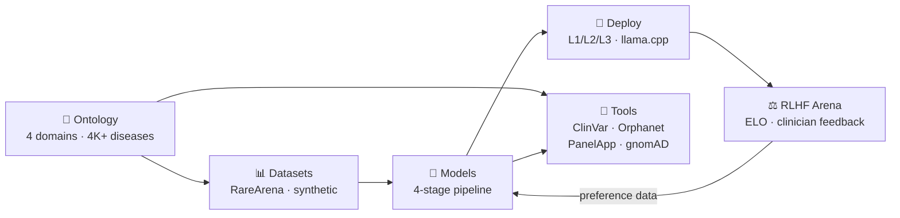

# Rare AI Archive

[](https://github.com/Wilhelm-Foundation/rare-archive/actions/workflows/ci.yaml)
[](LICENSE)
[](https://huggingface.co/Wilhelm-Foundation)
[](https://python.org)

**A decentralized post-training, model validation, and clinical deployment ecosystem for rare genetic diseases.**

*A program of the [Wilhelm Foundation](https://wilhelm.foundation)*

## Current Status

| Item | Status |
|------|--------|
| **4B SFT model** | Published to HuggingFace — [Wilhelm-Foundation/rare-archive-qwen-4b-sft-v1](https://huggingface.co/Wilhelm-Foundation/rare-archive-qwen-4b-sft-v1) |
| **35B MoE training** | In progress (~March 25 completion) |
| **L2 deployment** | Live — OpenWebUI + 7 clinical tools on GPU 3 |
| **L1 local inference** | Verified — Metal + llama.cpp (see [L1 setup guide](docs/l1_local_setup.md)) |
| **RLHF arena** | Planned (M10) |

### Key Results

- **4B SFT**: 21.5% Top-1 accuracy (21.5x improvement over base model)
- **Training data**: 63,212 records across 4 disease categories
- **Clinical tools**: 7 live adapters (ClinVar, Orphanet, HPO, PanelApp, gnomAD, PubMed, DiffDx)

---

300 million people worldwide live with a rare disease. The average diagnostic odyssey takes 5–7 years. During that time, families navigate a maze of specialists, tests, and uncertainty — often without ever receiving a diagnosis.

The Rare AI Archive exists to close that gap.

We build open-source AI models specialized in rare disease diagnostics, validated by the clinicians who treat these patients, and deployable at every scale — from a laptop in a rural clinic to a GPU cluster in a research hospital.

## How It Works



## Architecture

The Archive is built on the [Lattice Protocol](https://github.com/LatticeProtocol) standard and organized as a monorepo:

| Package | Purpose |
|---------|---------|
| **[packages/ontology](packages/ontology)** | Disease clustering, clinical tool registry, model/dataset schemas |
| **[packages/models](packages/models)** | 4-stage training pipeline: SFT → Tool-Use → DPO/GRPO → RL |
| **[packages/datasets](packages/datasets)** | RareArena ingestion, synthetic patients, preference data |
| **[packages/rlhf](packages/rlhf)** | Clinician evaluation portal with multi-dimensional ELO |
| **[packages/tools](packages/tools)** | Clinical tool integrations (ClinVar, Orphanet, PanelApp, gnomAD, HPO, PubMed) |
| **[packages/compliance](packages/compliance)** | FAIR scoring, aDNA schema validation, governance |
| **[deploy](deploy)** | Docker Compose overlays for L1/L2 deployment |
| **[docs](docs)** | Guides: [quantization](docs/quantization_guide.md), [evaluation](docs/evaluation_metrics.md), [troubleshooting](docs/troubleshooting.md), [tool integration](docs/tool_integration_spec.md), [L1 setup](docs/l1_local_setup.md) |

## Quick Start

```bash
# Install all packages in development mode
./scripts/setup_dev.sh

# Validate the archive
python scripts/validate_archive.py .
```

## Training Pipeline

We fine-tune [Qwen 3.5](https://huggingface.co/Qwen) models across 4 progressive stages:

| Stage | Method | Data Source | Goal |
|-------|--------|-------------|------|
| 1. SFT | Supervised fine-tuning | RareArena + synthetic cases | Clinical diagnostic reasoning |
| 2. Tool-Use SFT | Agentic traces | Gold-standard tool invocations | ClinVar/Orphanet/PanelApp usage |
| 3. DPO/GRPO | Preference alignment | Clinician evaluations from L2 | Expert-aligned reasoning |
| 4. Progressive RL | Reward optimization | RareArena-derived reward | Top-1 diagnostic accuracy |

**Frameworks:** [Unsloth](https://github.com/unslothai/unsloth) for all model sizes (QLoRA). Dense models use 4-bit quantization; MoE models use bf16 with `lora_dropout=0.0`.

## Model Priority

| Priority | Model | Params | GGUF Size | Deployment | Status |
|----------|-------|--------|-----------|------------|--------|
| 1 | [Qwen3.5-4B](https://huggingface.co/Wilhelm-Foundation/rare-archive-qwen-4b-sft-v1) | 4B dense | ~3 GB | L1 standard | **Published** |
| 2 | Qwen3.5-9B | 9B dense | ~6.5 GB | L1 primary | Planned |
| 3 | Qwen3.5-27B | 27B dense | ~16 GB | L2 standard | Planned |
| 4 | Qwen3.5-35B-A3B | 35B MoE (3B active) | ~37 GB | L2 efficient | Training |

> **Download models:** All published models are available at [huggingface.co/Wilhelm-Foundation](https://huggingface.co/Wilhelm-Foundation) in GGUF format for local inference.

## Example Output

Query: *"8-year-old with progressive proximal muscle weakness, elevated CK, Gower sign positive"*

```
Differential Diagnosis:
1. Duchenne Muscular Dystrophy (DMD) — most likely given age, sex-linked
   inheritance pattern, proximal weakness, and markedly elevated CK
2. Becker Muscular Dystrophy (BMD) — milder variant, later onset possible
3. Limb-Girdle Muscular Dystrophy (LGMD) — autosomal forms to consider

Recommended workups:
- Dystrophin gene (DMD) sequencing via ClinVar [tool: clinvar_lookup]
- HPO phenotype matching for HP:0003236 (elevated CK) [tool: hpo_lookup]
- PanelApp neuromuscular panel review [tool: panelapp_search]
```

## Built on Lattice Protocol

The Rare AI Archive follows the [Lattice Protocol](https://github.com/LatticeProtocol) standard:
- **Three primitives:** Dataset, Module, Lattice
- **aDNA metadata:** Embedded agentic DNA for each package
- **Compute tiers:** L1 (edge), L2 (cluster), L3 (datacenter)

## Contributing

See [CONTRIBUTING.md](CONTRIBUTING.md) for how to get involved. Whether you're a clinician, ML engineer, bioinformatician, or patient advocate — there's a place for you.

## License

Apache 2.0 — see [LICENSE](LICENSE) for details.

---

*Built by people who believe that no disease is too rare to matter.*
